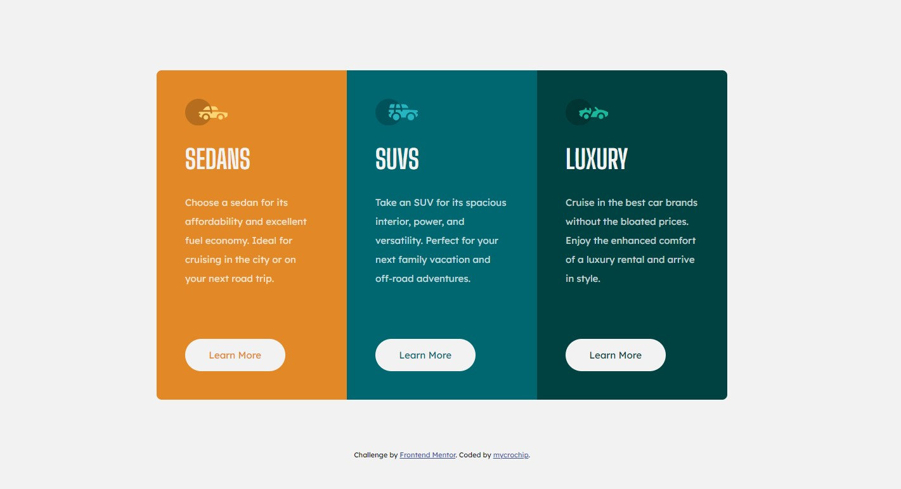

# Frontend Mentor - 3-column preview card component solution

This is a solution to the [3-column preview card component challenge on Frontend Mentor](https://www.frontendmentor.io/challenges/3column-preview-card-component-pH92eAR2-). Frontend Mentor challenges help you improve your coding skills by building realistic projects. 

## Table of contents

- [Overview](#overview)
  - [The challenge](#the-challenge)
  - [Screenshot](#screenshot)
  - [Links](#links)
- [My process](#my-process)
  - [Built with](#built-with)
  - [What I learned](#what-i-learned)
  - [Continued development](#continued-development)
- [Author](#author)


## Overview

### The challenge

Users should be able to:

- View the optimal layout depending on their device's screen size
- See hover states for interactive elements

### Screenshot
- Mobile view


- Desktop view


### Links

- Solution URL: [https://github.com/mycrochip/3-column-preview-card-component.git](https://github.com/mycrochip/3-column-preview-card-component.git)
- Live Site URL: [https://mycrochip.github.io/3-column-preview-card-component/](https://mycrochip.github.io/3-column-preview-card-component/)


## My process

### Built with

- Semantic HTML5 markup and BEM naming
- CSS custom properties
- Flexbox
- Mobile-first workflow

### What I learned

I got to use semantic html and OOCSS "ObectvOriented CSS" approach in my solution. This made my codes considerably lesser and more readable. It also allowed me to make the quickest of changs to my code; I know single changes to make that would affect replicate layouts simultaneously.

I also left more detailed styling to deeply nested markups in my html while styling with css. 

For example, general layout styles were given to parent classes while text styles were given to child elements as follows


```css
.card {
    display: flex;
    flex-direction: column;
    justify-content: center;
    align-content: center;
    width: 90vw;
    min-width: 235px;
    max-width: 900px;
    margin: auto;
    margin-bottom: 3rem;
    border-radius: 0.5rem;
    overflow: hidden;
}

.card__1,
.card__2,
.card__3 {
    display: flex;
    flex-direction: column;
    padding: 15%;
}
```

I avoided a lot of repetition in my css by sprinkling OOCSS the following way:

```css
.card__1--logo,
.card__2--logo,
.card__3--logo {
    background-repeat: no-repeat;
    background-size: cover;
    width: 4.16rem; /*3.2 ...*/
    height: 2.6rem; /*...by 2*/
}

.card__1--logo {
    background-image: url(images/icon-sedans.svg);
}

.card__2--logo {
    background-image: url(images/icon-suvs.svg);
}

.card__3--logo {
    background-image: url(images/icon-luxury.svg);
}
```
I believe in having readable code and a universal workflow amongst developers.

### Continued development

...more challenges. Thanks to [Frontend Mentor](https://www.frontendmentor.io)


## Author

- Frontend Mentor - [@mycrochip](https://www.frontendmentor.io/profile/mycrochip)
- Twitter - [@mycrochip_world](https://www.twitter.com/mycrochio_world)